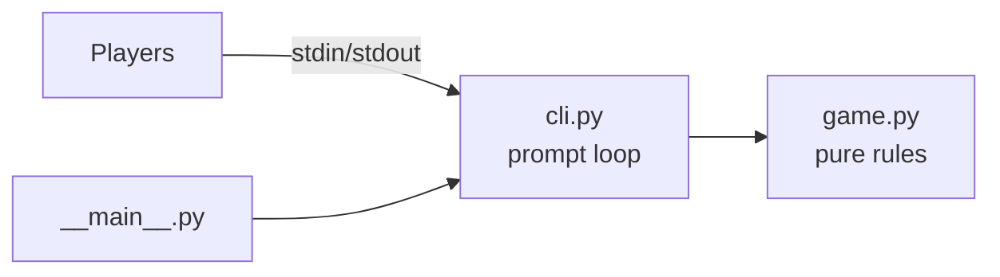

# Technical Design — Tic tac toe game

| Field | Value |
|---|---|
| Requirements | docs/02-requirements/requirements.md (v0.1, approved 2026-10-01) |
| Tech Lead | Pino |
| Status | In review |

## 1. Overview
A greenfield Python 3.10+ terminal program, standard library only (NFR-1). It is split into a **pure rules core** (no I/O) and a **thin CLI shell** that reads stdin and writes stdout (ADR-001). This lets every AC be tested automatically without a real terminal (NFR-2). Tests use stdlib `unittest` (ADR-002). There is no data store, no network and no configuration.

## 2. Current state
No code yet; the repo contains only `CLAUDE.md`, `.sdlc/` and `docs/`. Greenfield. No standing rules recorded yet.

## 3. Proposed design
### 3.1 Components


Layout:
```
tictactoe/__init__.py
tictactoe/game.py      # pure rules, no I/O
tictactoe/cli.py       # prompts, messages, loops, exit handling
tictactoe/__main__.py  # entry: python -m tictactoe (from the repo root, no setup)
tests/test_game.py         # unit tests for the core
tests/test_cli.py          # tests for the CLI using fake input/output
```

### 3.2 Data model
In memory only — no persistence.

| Entity | Shape | Notes |
|---|---|---|
| Board | `list[str]` of length 9; each is `" "`, `"X"` or `"O"`; index 0–8 = cell 1–9 | New list per game (AC-6.2) |
| Player | `"X"` or `"O"` | Starts as `"X"` every game (BR-1) |
| Outcome | `"X"`, `"O"`, `"draw"` or `None` (game in progress) | Win takes priority over draw (AC-4.3) |

### 3.3 Interfaces
**`game.py` (pure functions)**

| Function | Input | Output | Errors |
|---|---|---|---|
| `new_board()` | — | empty board | — |
| `parse_cell(text)` | raw input string | cell index 0–8 | `ValueError` unless the trimmed text is exactly one ASCII char in `"123456789"` (AC-2.3, AC-3.1) |
| `apply_move(board, idx, player)` | board, index, player | **new** board | raises `CellTaken` if occupied (AC-3.2); the input board is never mutated (AC-3.3) |
| `class CellTaken(ValueError)` | — | — | Carries no message text. The CLI builds "Cell <n> is taken. Choose another." from the cell number it parsed. |
| `outcome(board)` | board | `"X"`/`"O"`/`"draw"`/`None` | checks 8 lines first, then full board (AC-4.1–4.3) |
| `other(player)` | `"X"`/`"O"` | the other mark | — |
| `render(board)` | board | multi-line string in the exact AC-1.1 format; empty cells show their number | — |

**`cli.py`**

| Function | Behaviour |
|---|---|
| `play_game(input_fn, output_fn)` | Runs one game. Returns `"over"` when it ends, or `"quit"` when the player types `q`/`Q` (AC-5.1). |
| `ask_play_again(input_fn, output_fn)` | Returns `True` for `y`/`Y` and `False` for `n`/`N`, after trimming. Otherwise prints "Please enter y or n." and asks again (AC-6.1–6.4). |
| `main(input_fn=input, output_fn=print) -> int` | Loops `play_game` and `ask_play_again`. Catches `EOFError` and `KeyboardInterrupt`, prints "Goodbye." and returns 0 (AC-5.2, AC-5.3). |

`__main__.py` runs `sys.exit(main())` inside its own `try/except KeyboardInterrupt: sys.exit(0)`. This catches a late Windows Ctrl+C that arrives after `main` has already printed "Goodbye.", so it exits silently without printing it twice (DES-2, AC-5.3). All user-facing strings are module constants in `cli.py`, copied verbatim from the ACs.

**I/O conventions**
- **Prompts** (`Player X, choose a cell (1-9) or q: `, `Play again? (y/n): `) are passed to `input_fn(prompt)`, never to `output_fn`. `input()` then shows them with no newline, matching the exact prompts in AC-1.2, AC-2.2 and AC-6.1. In tests, the fake `input_fn` records each prompt it receives and returns the next scripted reply.
- **Messages** (the board, errors, results, "Goodbye.") go through `output_fn`, one call per message.
- **Input handling order in `play_game`:** trim the input → check for `q`/`Q` → `parse_cell` → `apply_move`. So `" q "` quits (AC-2.3, AC-5.1).
- **After a rejected move**, the CLI prints only the error message and prompts the same player again. It doesn't redraw the board, because the board hasn't changed (AC-3.3).
- **On end of input or Ctrl+C**, `main` prints an empty line before "Goodbye.", because the cursor is still on the prompt line (AC-5.4).

### 3.4 Main flow
```mermaid
sequenceDiagram
  participant P as Player
  participant C as cli
  participant G as game
  C->>P: render(empty board) + "Player X, choose a cell (1-9) or q: "
  P->>C: " 5 "
  C->>G: parse_cell → 4 ; apply_move → board' ; outcome → None
  C->>P: render(board') + "Player O, choose..."
  Note over C,G: loop until outcome ≠ None
  C->>P: final board + "Player X wins!" / "It's a draw!"
  C->>P: "Play again? (y/n): "
  P->>C: "y" → new game  |  "n" → "Goodbye.", exit 0
```

## 4. Edge cases & failure modes
| Case | Handling | AC |
|---|---|---|
| `""`, `"0"`, `"05"`, `"+5"`, `"5.0"`, `"10"`, `"a"`, `"٥"` | `parse_cell` raises `ValueError`; CLI prints the invalid-input message; same player, board unchanged | AC-3.1, AC-3.3 |
| `" 5 "` | Trimmed to `"5"` and accepted | AC-2.3 |
| `" q "` | Trimmed before the q/Q check → quits | AC-2.3, AC-5.1 |
| Occupied cell | `CellTaken` → "Cell <n> is taken. Choose another."; same player | AC-3.2, AC-3.3 |
| `q`/`Q` at the move prompt | "Goodbye.", exit 0 | AC-5.1 |
| `q` at the play-again prompt | Treated as invalid → "Please enter y or n." | AC-6.4 |
| End of input / Ctrl+C at either prompt | Caught in `main` → "Goodbye.", exit 0, no traceback | AC-5.2, AC-5.3 |
| Ninth move completes a line | `outcome` checks lines before checking for a full board → win | AC-4.3 |

## 5. Security, privacy, audit
No network, file or environment access; only stdin/stdout (NFR-3). No personal data is stored. No audit trail needed.

## 6. Observability
- Logs: none (an interactive toy program).
- Metrics / alerts: not applicable.

## 7. Rollout & rollback
- Feature flag: none.
- Release: run `python -m tictactoe` from the repo root. No packaging or path setup (DES-1).
- Rollback: `git revert`.

## 8. Requirement coverage
| AC / NFR | Component(s) | Notes |
|---|---|---|
| AC-1.1 | `game.render` | Exact format |
| AC-1.2, AC-2.2 | `cli.play_game` | Prompt constant includes the current player |
| AC-2.1 | `game.apply_move`, `cli.play_game` | Redisplay after the move |
| AC-2.3, AC-3.1 | `game.parse_cell`, `cli` message | |
| AC-3.2, AC-3.3 | `game.apply_move` (`CellTaken`, no mutation) | |
| AC-4.1 – AC-4.3 | `game.outcome`, `cli` messages | |
| AC-4.4 | `cli.main` | Game over → play-again prompt |
| AC-5.1 | `cli.play_game` | |
| AC-5.2, AC-5.3 | `cli.main` exception handling | |
| AC-5.4 | `cli.main` exception handling | Prints a blank line before "Goodbye." on end of input or Ctrl+C (added from QA GAP-1, REQ-4) |
| AC-6.1 – AC-6.4 | `cli.ask_play_again`, `cli.main` | |
| NFR-1 | Whole program | stdlib only |
| NFR-2 | ADR-001, ADR-002 | Injected `input_fn`/`output_fn` |
| NFR-3 | Whole program | No imports beyond `sys` |

## 9. Decisions (ADRs)
- ADR-001 — Pure rules core with an injectable-I/O CLI shell — Proposed
- ADR-002 — Use stdlib `unittest` for tests — Proposed

## 10. Risks & open questions
- [x] DES-1: Flat `tictactoe/` package at the repo root. Decided by Pino, 2026-10-01. Known gap: the code-gate hook watches `tests/` but not `tictactoe/`, and `sdlc_state.py` has no command to add a watched path. Until the marketplace gets one, the "no code before Planning is approved" rule is followed by convention for `tictactoe/`.
- [x] DES-2: Add the `KeyboardInterrupt` guard in `__main__.py`, and QA still checks it manually once on Windows. Decided by Pino, 2026-10-01.
